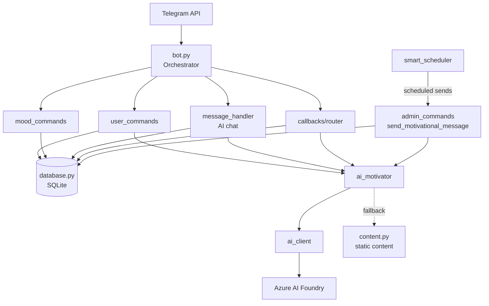

# Motivator Bot 🤖💙

A Telegram bot designed to support mental health and motivation through personalized, AI-powered messages and mood tracking. Perfect for individuals dealing with psychological challenges and their support networks.

## Features

### 🌟 Core Features
- **AI-Powered Conversations**: Chat freely with the bot — it replies empathetically, remembers your conversations, and knows what helps you (Azure AI Foundry, with static-content fallback)
- **Personalized Motivational Messages**: Scheduled supportive messages, generated by AI based on your mood, name, and what the bot has learned about you
- **Smart Scheduling**: Messages arrive at optimal times (morning/afternoon/evening peaks), respecting your active hours and minimum gaps
- **Mood Tracking**: Daily mood logging (1-10) with individual AI reactions; low moods temporarily increase message frequency
- **Bilingual Support**: English and German content
- **Feedback System**: Rate messages with ❤️/👍/👎 to improve content selection
- **Privacy Controls**: `/forgetme` deletes the AI's memory of you; data minimization built in

### 🎯 Mental Health Focus
- AI prompts enforce supportive, non-triggering language — no diagnoses, no medical advice
- Crisis indicators are never dropped from conversation summaries; crisis lines are surfaced when needed
- Content designed for anxiety, depression, and stress support
- The bot is a supportive tool, **not** a replacement for professional care

## Quick Start

### 1. Prerequisites
- Python 3.8+
- Telegram Bot Token (from [@BotFather](https://t.me/BotFather))
- Optional: Azure AI Foundry deployment for AI features (bot works without it, using static content)

### 2. Installation
```bash
git clone <repository-url>
cd motivator

# Create and activate virtual environment
python3 -m venv .venv
source .venv/bin/activate   # Windows: .venv\Scripts\activate

pip install --upgrade pip
pip install -r requirements.txt

# Configure environment
cp .env.example .env
nano .env                   # add BOT_TOKEN (and optionally AZURE_AI_*)
```

### 3. Run
```bash
python main.py
```

### Docker
```bash
cp .env.example .env        # configure first
docker compose up -d
docker compose logs -f      # JSON logs
```
The database is mounted as a volume and survives container restarts.

## Configuration

### Environment Variables (.env)

| Variable | Required | Description |
|---|---|---|
| `BOT_TOKEN` | yes | Telegram bot token from @BotFather |
| `ADMIN_USER_ID` | no | Telegram user ID allowed to run `/admin_*` commands |
| `AZURE_AI_ENDPOINT` | no | Azure AI Foundry OpenAI-compatible base URL |
| `AZURE_AI_DEPLOYMENT` | no | Model deployment name (e.g. `gpt-5-mini`) |
| `AZURE_AI_API_KEY` | no | API key for the AI endpoint |
| `LOG_LEVEL` | no | `DEBUG`, `INFO` (default), `WARNING`, `ERROR`, `CRITICAL` |
| `LOG_FORMAT` | no | `json` or `text` — auto-detected (json in containers) |
| `LOG_FILE` | no | Log file path (default: `motivator_bot.log` in dev, disabled in containers) |
| `CONTAINER_ENV` | no | Force container mode (`true`) — normally auto-detected |

If the three `AZURE_AI_*` variables are not set, every AI feature silently falls back to the static motivational content stored in the database.

### User Commands

| Command | Description |
|---|---|
| `/start` | Initialize bot, language selection |
| `/help` | Show all available commands |
| `/settings` | Language, frequency, timing, pause/resume, reset |
| `/mood` | Log mood (1-10 scale), get an individual AI reaction |
| `/stats` | View your usage statistics |
| `/motivateMe` | Get instant AI-generated motivation |
| `/pause` / `/resume` | Temporarily stop / restart scheduled messages |
| `/forgetme` | Delete the AI's conversation memory (history, summary, facts) |

Any **free-text message** to the bot starts an AI conversation.

### Admin Commands (require `ADMIN_USER_ID`)

| Command | Description |
|---|---|
| `/admin_stats` | System statistics |
| `/admin_broadcast` | Send a message to all users |
| `/admin_users` | User management and details |
| `/admin_content` | Static content management (`list`, `add`, `remove <id>`, `stats`) |
| `/admin_reset` | Reset user data |

## Architecture

### File Structure
```
motivator/
├── main.py                     # Entry point: env setup, logging init, starts bot
├── src/
│   ├── bot.py                  # Orchestrator: wires handlers, runs the application
│   ├── database.py             # SQLite operations (users, moods, content, AI memory)
│   ├── content.py              # Static motivational content management
│   ├── ai_client.py            # Generic async OpenAI-compatible client (Azure AI Foundry)
│   ├── ai_motivator.py         # AI prompt layer: motivation, chat, mood reactions,
│   │                           #   summarization, fact extraction
│   ├── smart_scheduler.py      # APScheduler-based smart message scheduling
│   ├── logging_config.py       # Structured logging (JSON/text, correlation IDs)
│   └── handlers/
│       ├── base.py             # Shared handler utilities
│       ├── user_commands.py    # /start /help /settings /pause /resume /motivateMe /forgetme
│       ├── mood_commands.py    # /mood /stats
│       ├── admin_commands.py   # /admin_* + scheduled message sending
│       ├── message_handler.py  # Free-text messages → AI chat + memory maintenance
│       └── callbacks/          # Inline-keyboard callback handlers
│           ├── router.py       # Central callback routing
│           ├── settings.py     # Language/frequency/timing callbacks
│           ├── mood.py         # Mood selection + message feedback callbacks
│           └── admin.py        # Admin operation callbacks
├── tests/                      # Pytest test suite
├── scripts/                    # Content import/migration helpers
├── Dockerfile / docker-compose.yml
└── requirements.txt
```

### Component Overview



### AI Integration & Conversation Memory

The AI layer has two modules:

- **`ai_client.py`** — a thin, generic async client for the OpenAI-compatible Responses API. Returns `None` on any failure so callers can always fall back.
- **`ai_motivator.py`** — builds mental-health-aware prompts. Every AI path receives the user's **name**, **last mood**, and **long-term facts**.

Conversation memory is designed so the AI context stays small no matter how long you chat:

```
AI context per reply = rolling summary  +  user facts  +  recent verbatim turns
                       (everything old,    (max 15 long-     (up to ~20 messages)
                        compressed)         term facts)
```

1. Every chat turn (user + assistant) is stored in `chat_messages`.
2. When more than **20 unsummarized turns** accumulate, a background task folds the oldest into the **rolling summary** (keeping the last 8 verbatim). The summarization prompt must preserve emotional state, life circumstances, what helps/harms the user, and crisis indicators.
3. The same task updates the **fact list**: stable knowledge like "has a dog named Bello", "night shifts are stressful", "walks by the lake help". Facts flow into *all* AI messages — including scheduled motivation, where no chat context exists.
4. **Data minimization**: a daily 3 AM job deletes raw messages that are already summarized and older than 30 days. `/forgetme` deletes everything the AI remembers at any time.

### Smart Message Scheduling

- Hourly check decides per user whether to send, based on message frequency, active hours, and minimum gap (1-6 h)
- Peak-focused distribution: ~60% of messages during morning (8-10), afternoon (14-16), and evening (18-20) peaks
- Mood boost: after a low mood entry (≤4) frequency +50%, very low (≤2) +100%
- Daily mood reminder at 8 PM if no mood was logged
- Engagement is tracked to enable learning optimal send times

### Message Flow (scheduled message)
1. `smart_scheduler` decides a user should get a message and schedules it within the next hour
2. `admin_commands.send_motivational_message` loads settings, last mood, and user facts
3. `ai_motivator.generate_motivation` produces a personalized message (fallback: mood-based static content, avoiding recent duplicates)
4. Message is sent and logged in `sent_messages`; engagement lands in `message_schedule_log`

## Database Schema

SQLite (`motivator.db`), created automatically on first run.

| Table | Purpose |
|---|---|
| `users` | Profile & settings: language, message frequency, active flag, first name |
| `user_timing_preferences` | Active hours, minimum gap, peak windows, mood boost, per user |
| `mood_entries` | Mood log: score (1-10), optional note, timestamp |
| `sent_messages` | Every sent message: type (`text`, `ai_text`, …), content reference |
| `feedback` | User reactions (❤️/👍/👎) to messages |
| `message_schedule_log` | Scheduled vs. actual send time, engagement — basis for timing learning |
| `motivational_content` | Static motivational content: language, category, type, media URL |
| `chat_messages` | Raw AI conversation turns (`user`/`assistant`), flagged once summarized |
| `chat_summaries` | Rolling conversation summary, one row per user+chat |
| `user_facts` | Long-term facts the AI learned about the user (max 15) |

Useful queries:
```sql
-- Recent conversation of a user
SELECT role, content, created_at FROM chat_messages
WHERE user_id = 123 ORDER BY id DESC LIMIT 20;

-- What the AI knows about a user
SELECT fact FROM user_facts WHERE user_id = 123;

-- Mood trend
SELECT mood_score, created_at FROM mood_entries
WHERE user_id = 123 ORDER BY created_at DESC;

-- Message effectiveness
SELECT feedback_type, COUNT(*) FROM feedback GROUP BY feedback_type;

-- Static content by language/category
SELECT language, category, COUNT(*) FROM motivational_content
WHERE active = 1 GROUP BY language, category;
```

## Static Content Management

Static content is the fallback when AI is unavailable and lives in the `motivational_content` table.

```python
from src.database import Database

db = Database()
db.add_content(
    content="Your custom motivational message here",
    content_type="text",      # text, image, video, link
    language="en",            # en or de
    category="motivation",    # anxiety, depression, stress, motivation, self_care, general
    media_url=None            # optional: URL for videos/links
)
```

Alternatives: `/admin_content` bot commands, or bulk import via `python scripts/migrate_content_to_db.py`.

## Logging & Monitoring

Dual-format structured logging: human-readable text in development, JSON in containers (auto-detected).

```bash
# Development
tail -f motivator_bot.log

# Container
docker compose logs -f
docker compose logs -f | jq 'select(.level == "ERROR")'
docker compose logs -f | jq 'select(.correlation_id == "msg_abc123")'
```

See `CLAUDE.md` for the full logging reference (correlation IDs, `log_with_context`, formats).

## Testing

```bash
# Run the test suite
pytest
```
AI calls are automatically disabled in tests (see `tests/conftest.py`), so the suite runs offline and exercises the static fallback paths.

## Privacy & Security

- **All data stays local**: SQLite database on your system, no cloud storage
- **Chat content is sensitive health data**: conversation turns are sent to the configured AI endpoint for reply generation, but persisted only locally
- **User control**: `/forgetme` wipes AI memory; `/settings` → Reset wipes everything
- **Data minimization**: summarized raw chat messages are auto-deleted after 30 days
- **Secrets**: bot token and API keys live in `.env` (gitignored, excluded from Docker builds)

## Troubleshooting

1. **Bot not responding**: check `BOT_TOKEN` in `.env`, check startup logs
2. **AI answers missing / only static content**: `AZURE_AI_*` variables missing or wrong — check logs for "AI request failed"
3. **Database errors**: ensure write permissions in the bot directory
4. **Scheduler issues**: check system time/timezone and user timing preferences
5. **Module not found**: activate the virtual environment (`source .venv/bin/activate`)

### Database Reset
```bash
cp motivator.db motivator.db.backup   # backup first!
rm motivator.db
python main.py                        # recreates an empty database
```

## Support Resources

- **Germany — Telefonseelsorge**: 0800 111 0 111 (free, 24/7)
- **US — Suicide & Crisis Lifeline**: 988
- **International**: https://findahelpline.com

---

**Remember**: This bot is a supportive tool and should not replace professional mental health care. If you're experiencing a mental health crisis, please contact emergency services or a mental health professional immediately.
